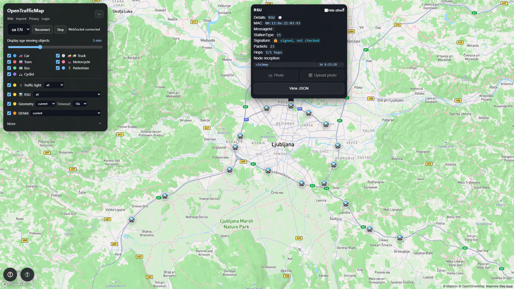
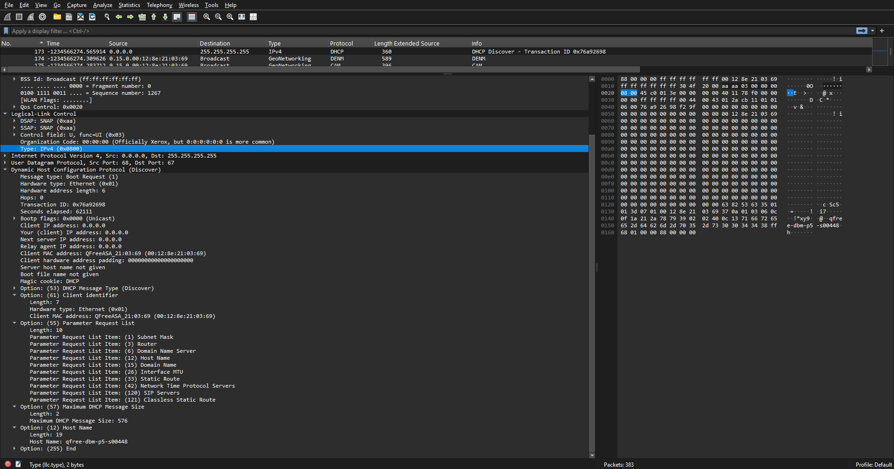

I recently saw the great talk at [Grazer Linuxtage 2026](https://linuxtage.at) about the [OpenTrafficMap project](https://opentrafficmap.org/) and the C-ITS/V2X system. It sparked interest, as I remembered that we deployed some C-ITS transmitters in Slovenia a while ago as part of the [C-Roads project](https://www.gov.si/en/registries/projects/c-roads-slovenija-partnerski-projekt/) and I wanted to see if they worked and what else I could pick up.

After ordering a [WaveShare ESP32-C5](https://www.waveshare.com/esp32-c5-wifi6-kit-n16r4.htm) kit and flashing it with [v2x2map](https://github.com/pit711/v2x2map/), I set off towards Ljubljana with a running PCAP in the app and an MQTT session towards the OTM server. After the drive, I checked the web app and sure enough, some RSUs appeared.

I then went to look at the PCAP files I generated and saw something peculiar: A DHCP request, originating from a Road Side Unit by [Q-Free](https://www.q-free.com/) requesting an IP, NTP and SIP servers.

I sent a screenshot of this to a friend who works with the Slovenian Highway Agency as a funny side-note, but the next day, I received a call of "Congratulations, you have a Crate of Beer[^1] waiting at my office for that." Turns out, someone left DHCP enabled on all interfaces on the boxes during a recent reconfiguration. Driving to Ljubljana a few days later, I already noticed that the DHCP requests were no more. Another win for cybersecurity.

## Making an extcap plugin

I wanted to make myself a better pipeline for live monitoring of packets, since the V2X2MAP app was quite basic in what it displays during capture. I wanted to create a live PCAP I could monitor in Wireshark. Doing so, I looked at the wire protocol used by the project and it was quite simple:

    magic[4]  = "ITS5"
    sec       u32 LE
    usec      u32 LE
    len       u16 LE
    payload   <len> bytes  (raw 802.11 MAC frame)

I looked at what an [extcap](https://www.wireshark.org/docs/man-pages/extcap.html) plugin is and how they work. After some help from ChatGPT, I had a working extcap plugin that allowed me to live stream traffic received by the ESP32. You can find the code on my [GitHub](https://github.com/craftbyte/v2x2map-extcap).

## Conclusion and future plans

All in all, C-ITS seems to be the hot new thing everyone is starting to look into and we can expect more issues like the DHCP popping up around Europe as hackers descend upon the network. I am currently working on a working transmitter using the ESP32-C5 by SEEED XIAO that will allow a very basic CAM profile to work, maybe even in time for [EMF 2026](https://emfcamp.org). I want to thank Peter and mick for their talk and inspiring people to start playing with this tech.

[^1]: A crate of beer is a customary currency used in the Slovenian tech community when people do favours for each other, usually without official recognition from their employers. It is also usually used as a bug bounty reward when companies don't have an official bug bounty program and is usually bought by the developer/security team themselves.